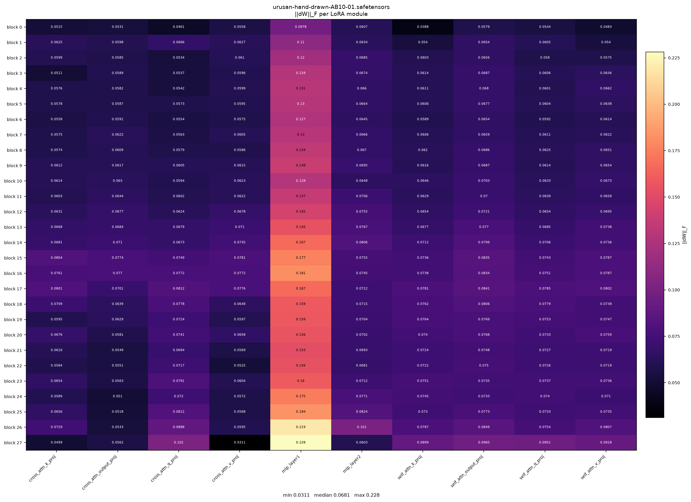
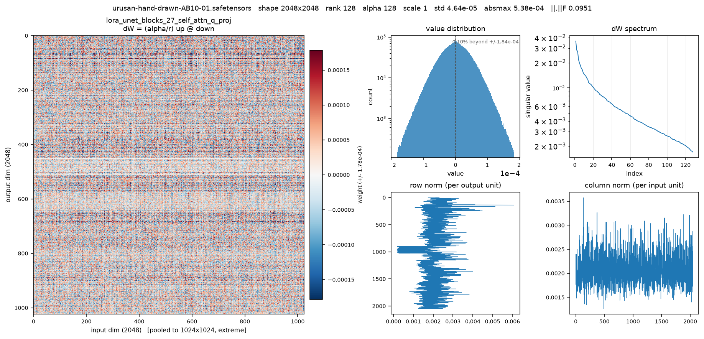
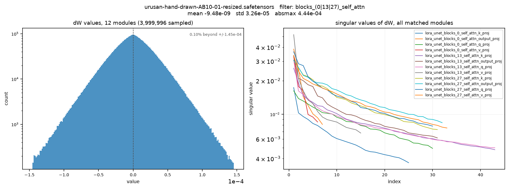
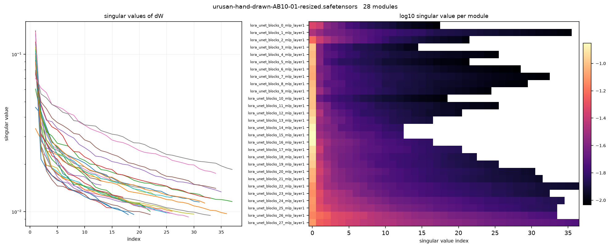
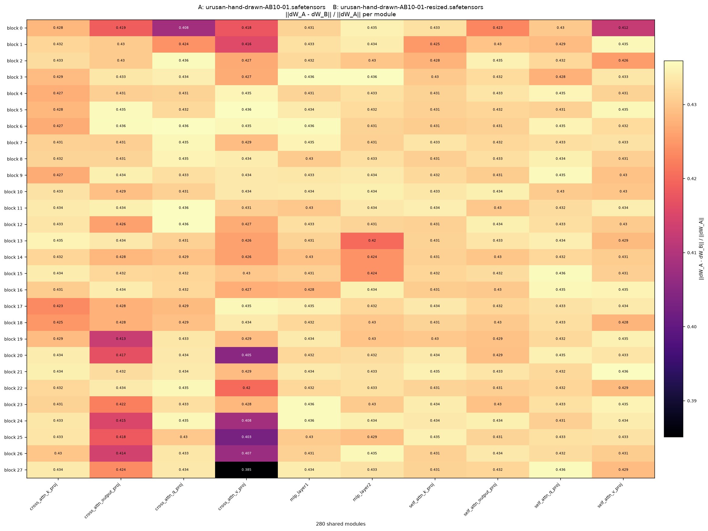
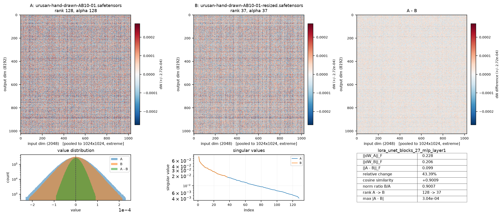

# loraview

A dependency-light tool for inspecting and visualizing LoRA weights stored in
`.safetensors` files. It reads the file directly (memory-mapped, no `torch` or
`safetensors` package required) and turns it into tables and plots you can use
to understand a LoRA, sanity-check a resize, or compare two checkpoints.

## The core idea

A kohya-style LoRA stores, per patched layer:

```
<module>.lora_down.weight   [r, in]
<module>.lora_up.weight     [out, r]
<module>.alpha               scalar
```

but the update actually applied to the base model is:

```
dW = (alpha / r) * lora_up @ lora_down          shape [out, in]
```

`dW` is what every command in this tool works with, rather than the raw
`lora_down` / `lora_up` factors. That matters because raw factors from two
files aren't comparable when the files have different ranks (e.g. a fixed
rank-128 LoRA vs. one resized down to a dynamic rank), while `dW` always lives
in the base model's weight space and is directly comparable. Norms, inner
products and singular values are computed exactly from small `r`-by-`r` Gram
matrices, so even a 280-module comparison never materializes a full
`8192x2048` matrix and runs in a few seconds.

## Installation

Requires Python 3.10+. The only dependencies are `numpy` and `matplotlib`:

```bash
python3 -m venv .venv
.venv/bin/pip install -r requirements.txt
```

The interactive `browse` command additionally needs a GUI backend for
matplotlib (e.g. `tkinter`, `PySide6`, or `PyQt5`). If your Python has no
usable backend, install one, for example:

```bash
.venv/bin/pip install PySide6
```

## Usage

Run any command as a module:

```bash
.venv/bin/python -m loraview <command> FILE [options]
```

### `info` — file, module and metadata summary

```bash
.venv/bin/python -m loraview info my_lora.safetensors
```

Prints file size, module/tensor counts, the detected blocks and roles, the
distinct ranks/alphas/dtypes in use, and a curated slice of training metadata
(`--all-metadata` for everything).

### `list` — per-module table of shapes and dW statistics

```bash
.venv/bin/python -m loraview list my_lora.safetensors --sort fro --top 20
```

One row per module: shape, rank, alpha, scale, `||dW||_F`, RMS, top singular
value, and effective rank. Filter with `-p/--pattern` (regex on the module
name), add `--full` for element-wise stats, or `--json` for machine-readable
output.

### `overview` — heat map of one statistic across all modules

```bash
.venv/bin/python -m loraview overview my_lora.safetensors -m fro
```



Lays every module out on a blocks x roles grid, colored by a chosen metric
(`fro`, `rms`, `absmax`, `std`, `rank`, `alpha`, `scale`, `spectral`,
`effrank`). Useful for spotting which layers and depths carry the most
signal at a glance.

### `heatmap` — visualize one module's weights

```bash
.venv/bin/python -m loraview heatmap my_lora.safetensors lora_unet_blocks_27_self_attn_q_proj
```



`MODULE` can be an exact name or a unique substring/regex. Shows the weight
matrix itself (downsampled with sign-preserving pooling so it stays readable
at any resolution), its value distribution, singular-value spectrum, and
per-row/per-column norms. Use `--what down|up` to look at a raw factor
instead of `dW`.

### `hist` — value distribution across modules

```bash
.venv/bin/python -m loraview hist my_lora.safetensors -p 'blocks_(0|13|27)_self_attn'
```



Histogram of sampled `dW` values plus overlaid singular-value spectra for
every module matched by `-p/--pattern`.

### `spectrum` — singular values of dW per module

```bash
.venv/bin/python -m loraview spectrum my_lora.safetensors
```



Line plot of every module's singular values plus a per-module heat map
version of the same data, so you can see how much of a module's rank budget
is actually used.

### `compare` — compare two files module by module

```bash
.venv/bin/python -m loraview compare a.safetensors b.safetensors -m relative
```



Matches modules by name and shape across two files (e.g. a checkpoint before
and after a resize, or two training runs) and prints a summary table plus a
heat map of one metric (`relative`, `absolute`, `cosine`, `ratio`, `norm_a`,
`norm_b`). Add `--json` for the raw numbers.

Pass `--module NAME` to drill into a single module instead of the grid:

```bash
.venv/bin/python -m loraview compare a.safetensors b.safetensors --module lora_unet_blocks_27_mlp_layer1
```



### `browse` — interactive module browser

```bash
.venv/bin/python -m loraview browse my_lora.safetensors [second.safetensors]
```

Opens a matplotlib window you can step through with the keyboard or a
slider. With one file it shows the module's matrix plus its distribution;
with two files (of the same shape) it shows A, B, and A−B side by side on a
shared color scale.

| Key           | Action                                          |
|---------------|--------------------------------------------------|
| `←` / `→`     | previous / next module                          |
| `↑` / `↓`     | jump to the same layer role in the next/previous block |
| `d`           | cycle `dW` / `lora_down` / `lora_up`            |
| `p`           | cycle pooling mode (`extreme` / `mean` / `rms`) |
| `s`           | save the current view as a PNG                  |
| `q`           | quit                                            |

### Common plotting options

All plotting commands accept:

- `-o/--out PATH` — save the figure instead of the default filename
- `--show` — open an interactive window instead of saving
- `--dpi N` (default 140)
- `--max-side N`, `--pool extreme|mean|rms`, `--percentile N` — control how
  large matrices are downsampled and color-scaled for module-level plots.
  `extreme` (the default) keeps the largest-magnitude element per block with
  its sign, since averaging would wash out the ± structure that's usually
  the point of looking. Color scales are diverging and symmetric about
  zero, clipped at the given percentile of `|value|` (default 99.5).
